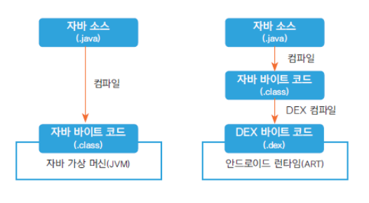

# Android
{: .no_toc }

Android의 특징과 개발 환경을 알아본다.
{: .fs-6 .fw-300 }

## Table of contents
{: .no_toc .text-delta }

1. TOC
{:toc}

---

## Android 개요

Android는 **리눅스 기반의 운영체제**로, 모든 응용 프로그램이 평등한 환경에서 동작하는 것을 목표로 한다. 기본 내장된 앱과 개발자가 만든 앱은 동일한 환경에서 **같은 API**를 사용할 수 있다.

- **Android 런타임 (ART)** : 애플리케이션을 실행하는 역할을 담당.
- **자바 API 프레임워크** : 앱 개발 시 활용되는 자바 기반 API.
- **DEX 파일** : 자바 클래스를 바로 실행하지 않고 DEX 파일로 컴파일해 최적화된 상태로 실행.
  
  

## Android의 주요 특징

1. **리눅스 기반 시스템**  
   - 안정성과 확장성을 제공하며, 네이티브 라이브러리와 커널 기능을 통해 하드웨어에 접근.

2. **동일한 API 제공**  
   - Android 플랫폼에 탑재된 모든 앱은 동일한 환경에서 실행되며, 시스템 앱과 사용자 앱 간의 차별이 없음.

3. **컴포넌트 기반 개발**  
   - 안드로이드 앱은 여러 개의 **컴포넌트**(Activity, Service, Broadcast Receiver, Content Provider)로 구성되며, 각 컴포넌트는 독립적으로 실행된다.

4. **생명주기 관리**  
   - 컴포넌트마다 시스템에 의해 제어되는 생명주기가 존재. 
     - 일반 클래스: 개발자 코드로 직접 관리  
     - 컴포넌트 클래스: 안드로이드 시스템이 생명주기를 자동으로 관리  

## Android 앱 개발 특징

- **독립적인 컴포넌트 단위로 구성**  
  각 컴포넌트는 독립적인 실행 단위로 동작하며, 필요 시 개별적으로 시작되고 종료될 수 있다.

- **다양한 실행 시점**  
  Android 앱은 특정 이벤트나 사용자 입력에 따라 실행되며, 시스템이 컴포넌트를 필요로 할 때 자동으로 시작한다.  
  예: 알림을 받은 경우 **Broadcast Receiver**가 실행되거나, 사용자가 앱을 열면 **Activity**가 실행됨.

- **애플리케이션 라이브러리 사용**  
  Android는 다양한 기본 라이브러리를 제공하여, 개발자가 네트워크, 데이터베이스, 멀티미디어 등 다양한 기능을 쉽게 구현할 수 있다.

## Android의 런타임 및 컴파일 특징

- **Android 런타임 (ART)**  
  Android 앱은 DEX(Dalvik Executable) 파일로 컴파일되며, ART는 이를 실행하여 최적화된 성능을 제공한다.  
  DEX 파일은 메모리 사용을 줄이고, 여러 장치에서 효율적으로 동작하도록 설계되었다.

- **자바 기반 API와 호환성**  
  개발자는 자바로 코드를 작성하며, Android 프레임워크를 통해 다양한 기능을 사용할 수 있다.

